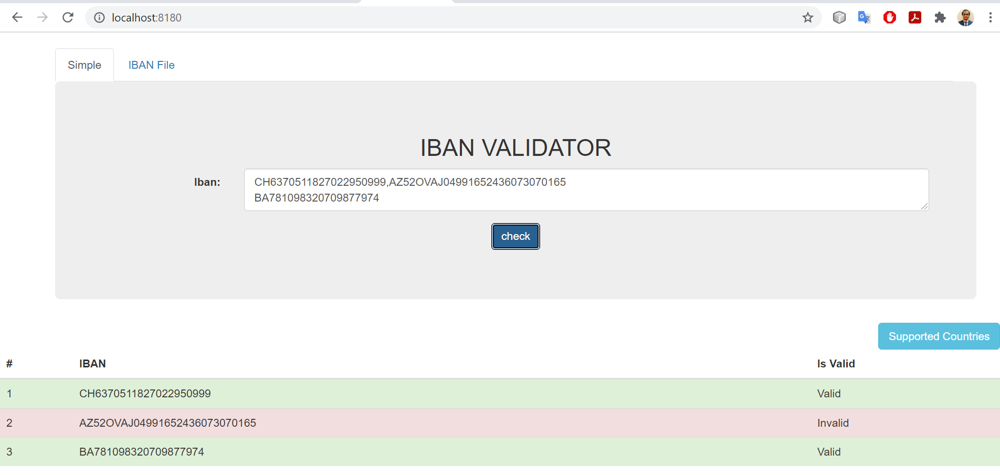
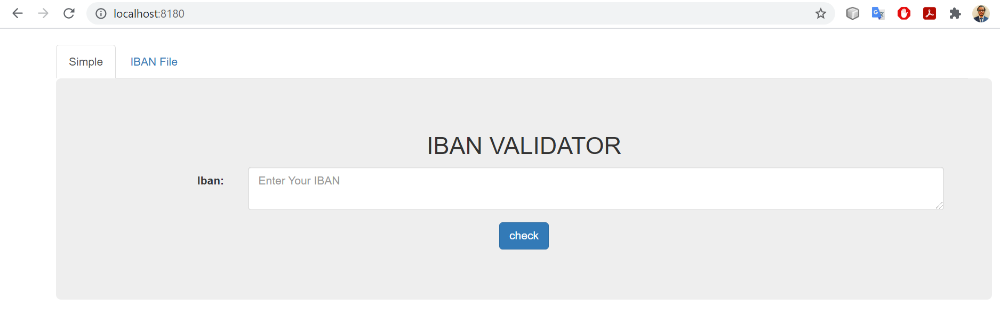
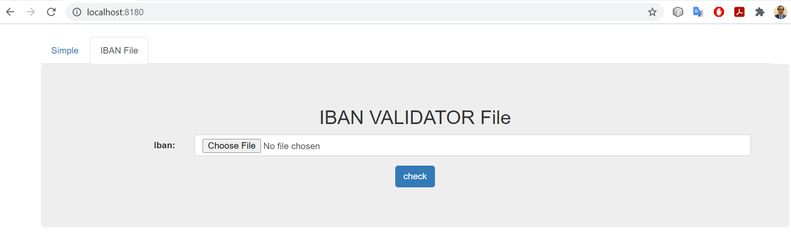

## **Introduction**

A small spring Boot service for validating IBAN. 

`IBAN` service enforce that their value is the correct length for its country code. The `Modulo97` class exposes the checksum validation code for other purposes, such as live input validation. It validate single as well as list of IBANs through api as well as UI. A UI support csv and text file for uploading


## Prerequisites 

The document intends that the following prerequisites are available:


1.  java runtime environment <a name="jre" >(jre)</a> 1.8 or above for specific OS (Linux,window etc).
2. Free 8081 Port on your machine
3. Browser (Optional) for User Interface.


## Installation


1. Open the console in your OS.
2. Check your java version by typing **<code>java -versionn</code></strong> in your console. [jre](#jre)
3. Run this command <strong><code>java -jar path/to/your/IBAN-VALIDATOR.jar &</code></strong>
4. <strong>voilà !<code> </code></strong>service has been started. 
5. You can see the default UI on http://localhost:8180/


## Features

A User Interface is given for a specific Port (8081). 





UI consist two Menu:


1. Validation of IBANs through TextArea.

    It can handle a single IBAN as well as a list of IBANs that is separated by comma (,) or new line character or Enter (/n). It print the valid output accordingly


    




2. Validation of IBANs through File.

    


## API’s


<table>
  <tr>
   <td><strong>Method</strong>
   </td>
   <td><strong>URL</strong>
   </td>
   <td><strong>Description</strong>
   </td>
   <td><strong>Return </strong>
   </td>
  </tr>
  <tr>
   <td>GET
   </td>
   <td>/fetch-list-supported-countries
   </td>
   <td>Fetch list of supported country
   </td>
   <td>JSON1
   </td>
  </tr>
  <tr>
   <td>GET
   </td>
   <td>/validate/codes=?
   </td>
   <td>Validate the single IBAN as well as LIST separated by , or \n
   </td>
   <td>JSON2
   </td>
  </tr>
  <tr>
   <td>POST
   </td>
   <td>/validate
   </td>
   <td>Validate the single IBAN as well as LIST separated by , or \n
   </td>
   <td>JSON
   </td>
  </tr>
  <tr>
   <td>POST
   </td>
   <td>/file/validate
   </td>
   <td>Validate the csv and text of IBAN as well as LIST separated by , or \n
   </td>
   <td>JSON
   </td>
  </tr>
</table>


## TEST CASEs

All the IBAN is created through this website. “https://www.mobilefish.com/services/random_iban_generator/random_iban_generator.php”


### single IBAN :


    Input code :EE225526502575365444


    Return #JSON


```
[{"code":1,"validFlag":true,"iban":"EE225526502575365444","message":"Valid"}]
```


### List 

AD1319798039630122776418,AE449890095651626954187,AL27736238127217732875384948,AT312709619447804596,AZ16AXOH01263307134117703214,BA902865652199186610,BE75237473644989,BG25HIOH99053157136481,BH87DCCH37735556699466,BR7108720071935680277969559G9,BY92665932171079316760795272,CH2224275484992316505,CR87099077825205707917,CY11252425516353298865515127,CZ9081723943271484675162,DE12518885122407754166,DK1587957998161066,DO69463969114752729542400599,EE199057353200732013,EG054245441999398515624124802,ES2344482930567353832899,FI3441217412876873,FO8276200800367300,FR6502491080789486242053249,GB98IOJV51912901622134,GE79FT2296026853463821,GI20INAE739396081410266,GL2385793609080628,GR0846779924437392550884795,GT82169074066345325661930811,HR2677912025261319683,HU84346026763574084469205824,IE61ZXGJ15961652677615,IL424995432500849370551,IQ52WJXL072362783938885,IS604017135537641228010003,IT33U4882539559237714056915,JO28RCTO7927511486542680736764,KW35LTFK2080239948674488700267,KZ544915675360588399,LB71716486383969591271273898,LC43IARB556702113111386703625447,LI681878874229181477,LT415477829384423958,LU8580%4764152923476,LV31DEBA9609961373362,LY63137269651028296864001,MC1315306604102593752292139,MD4918707431189650027962,ME89645263648468031616,MK87716709133686426,MR4917120221047126860603047,MT81JAVY06066927540054179034334,MU51DQDG7322046915338743763THG,NL02PCRK2351388364,NO3766958579842,PK52KZAO4573883878812523,PL47912679770716503506533895,PS37LNNK521261383499672054489,PT91831313116795192529216,QA88BOXD977842073836673784946,RO37NSXK9772099662352180,RS63556990569778930188,SA5342228275327659608569,SC65MWLP16434739119931421689OYX,SD5354331136791370,SE8860467369362413988968,SI75855829517448749,SK2000412829259240413757,SM92J1199365981631290599188,ST70301470361887470752454,SV73JIIG05300427188552445573,TL645236325434171805281,TN2700901160487557013942,TR497226293997756115470716,UA046028261153139360358352447,VA66423787574301141883,VG92HDQQ9743899708966648,XK533557195440977835,YY97YXDS85709950841724922887582698,ZZ48EWQX482552089452388616100333984

Return # JSON #2


```
[{"code":1,"validFlag":true,"iban":"AD1319798039630122776418","message":"Valid"},{"code":1,"validFlag":true,"iban":"AE449890095651626954187","message":"Valid"},{"code":1,"validFlag":true,"iban":"AL27736238127217732875384948","message":"Valid"},{"code":1,"validFlag":true,"iban":"AT312709619447804596","message":"Valid"},{"code":1,"validFlag":true,"iban":"AZ16AXOH01263307134117703214","message":"Valid"},{"code":1,"validFlag":true,"iban":"BA902865652199186610","message":"Valid"},{"code":1,"validFlag":true,"iban":"BE75237473644989","message":"Valid"},{"code":1,"validFlag":true,"iban":"BG25HIOH99053157136481","message":"Valid"},{"code":1,"validFlag":true,"iban":"BH87DCCH37735556699466","message":"Valid"},{"code":1,"validFlag":true,"iban":"BR7108720071935680277969559G9","message":"Valid"},{"code":-1,"validFlag":false,"iban":"BY92665932171079316760795272","message":"We don't Support this country right now"},{"code":1,"validFlag":true,"iban":"CH2224275484992316505","message":"Valid"},{"code":1,"validFlag":true,"iban":"CR87099077825205707917","message":"Valid"},{"code":41,"validFlag":false,"iban":"CY11252425516353298865515127","message":"Invalid"},{"code":1,"validFlag":true,"iban":"CZ9081723943271484675162","message":"Valid"},{"code":1,"validFlag":true,"iban":"DE12518885122407754166","message":"Valid"},{"code":1,"validFlag":true,"iban":"DK1587957998161066","message":"Valid"},{"code":1,"validFlag":true,"iban":"DO69463969114752729542400599","message":"Valid"},{"code":1,"validFlag":true,"iban":"EE199057353200732013","message":"Valid"},{"code":-1,"validFlag":false,"iban":"EG054245441999398515624124802","message":"We don't Support this country right now"},{"code":1,"validFlag":true,"iban":"ES2344482930567353832899","message":"Valid"},{"code":1,"validFlag":true,"iban":"FI3441217412876873","message":"Valid"},{"code":1,"validFlag":true,"iban":"FO8276200800367300","message":"Valid"},{"code":1,"validFlag":true,"iban":"FR6502491080789486242053249","message":"Valid"},{"code":1,"validFlag":true,"iban":"GB98IOJV51912901622134","message":"Valid"},{"code":1,"validFlag":true,"iban":"GE79FT2296026853463821","message":"Valid"},{"code":1,"validFlag":true,"iban":"GI20INAE739396081410266","message":"Valid"},{"code":1,"validFlag":true,"iban":"GL2385793609080628","message":"Valid"},{"code":1,"validFlag":true,"iban":"GR0846779924437392550884795","message":"Valid"},{"code":1,"validFlag":true,"iban":"GT82169074066345325661930811","message":"Valid"},{"code":1,"validFlag":true,"iban":"HR2677912025261319683","message":"Valid"},{"code":1,"validFlag":true,"iban":"HU84346026763574084469205824","message":"Valid"},{"code":1,"validFlag":true,"iban":"IE61ZXGJ15961652677615","message":"Valid"},{"code":1,"validFlag":true,"iban":"IL424995432500849370551","message":"Valid"},{"code":-1,"validFlag":false,"iban":"IQ52WJXL072362783938885","message":"We don't Support this country right now"},{"code":1,"validFlag":true,"iban":"IS604017135537641228010003","message":"Valid"},{"code":1,"validFlag":true,"iban":"IT33U4882539559237714056915","message":"Valid"},{"code":1,"validFlag":true,"iban":"JO28RCTO7927511486542680736764","message":"Valid"},{"code":1,"validFlag":true,"iban":"KW35LTFK2080239948674488700267","message":"Valid"},{"code":1,"validFlag":true,"iban":"KZ544915675360588399","message":"Valid"},{"code":1,"validFlag":true,"iban":"LB71716486383969591271273898","message":"Valid"},{"code":-1,"validFlag":false,"iban":"LC43IARB556702113111386703625447","message":"We don't Support this country right now"},{"code":-2,"validFlag":false,"iban":"LI681878874229181477","message":"Number of character is not Correct with respect to country"},{"code":1,"validFlag":true,"iban":"LT415477829384423958","message":"Valid"},{"code":-3,"validFlag":false,"iban":"LU8580%4764152923476","message":"Found weird character in Between"},{"code":1,"validFlag":true,"iban":"LV31DEBA9609961373362","message":"Valid"},{"code":-1,"validFlag":false,"iban":"LY63137269651028296864001","message":"We don't Support this country right now"},{"code":1,"validFlag":true,"iban":"MC1315306604102593752292139","message":"Valid"},{"code":1,"validFlag":true,"iban":"MD4918707431189650027962","message":"Valid"},{"code":1,"validFlag":true,"iban":"ME89645263648468031616","message":"Valid"},{"code":1,"validFlag":true,"iban":"MK87716709133686426","message":"Valid"},{"code":1,"validFlag":true,"iban":"MR4917120221047126860603047","message":"Valid"},{"code":1,"validFlag":true,"iban":"MT81JAVY06066927540054179034334","message":"Valid"},{"code":1,"validFlag":true,"iban":"MU51DQDG7322046915338743763THG","message":"Valid"},{"code":1,"validFlag":true,"iban":"NL02PCRK2351388364","message":"Valid"},{"code":1,"validFlag":true,"iban":"NO3766958579842","message":"Valid"},{"code":1,"validFlag":true,"iban":"PK52KZAO4573883878812523","message":"Valid"},{"code":1,"validFlag":true,"iban":"PL47912679770716503506533895","message":"Valid"},{"code":1,"validFlag":true,"iban":"PS37LNNK521261383499672054489","message":"Valid"},{"code":1,"validFlag":true,"iban":"PT91831313116795192529216","message":"Valid"},{"code":1,"validFlag":true,"iban":"QA88BOXD977842073836673784946","message":"Valid"},{"code":1,"validFlag":true,"iban":"RO37NSXK9772099662352180","message":"Valid"},{"code":1,"validFlag":true,"iban":"RS63556990569778930188","message":"Valid"},{"code":1,"validFlag":true,"iban":"SA5342228275327659608569","message":"Valid"},{"code":-1,"validFlag":false,"iban":"SC65MWLP16434739119931421689OYX","message":"We don't Support this country right now"},{"code":-1,"validFlag":false,"iban":"SD5354331136791370","message":"We don't Support this country right now"},{"code":1,"validFlag":true,"iban":"SE8860467369362413988968","message":"Valid"},{"code":1,"validFlag":true,"iban":"SI75855829517448749","message":"Valid"},{"code":1,"validFlag":true,"iban":"SK2000412829259240413757","message":"Valid"},{"code":1,"validFlag":true,"iban":"SM92J1199365981631290599188","message":"Valid"},{"code":-1,"validFlag":false,"iban":"ST70301470361887470752454","message":"We don't Support this country right now"},{"code":-1,"validFlag":false,"iban":"SV73JIIG05300427188552445573","message":"We don't Support this country right now"},{"code":-1,"validFlag":false,"iban":"TL645236325434171805281","message":"We don't Support this country right now"},{"code":1,"validFlag":true,"iban":"TN2700901160487557013942","message":"Valid"},{"code":1,"validFlag":true,"iban":"TR497226293997756115470716","message":"Valid"},{"code":-1,"validFlag":false,"iban":"UA046028261153139360358352447","message":"We don't Support this country right now"},{"code":-1,"validFlag":false,"iban":"VA66423787574301141883","message":"We don't Support this country right now"},{"code":1,"validFlag":true,"iban":"VG92HDQQ9743899708966648","message":"Valid"},{"code":-1,"validFlag":false,"iban":"XK533557195440977835","message":"We don't Support this country right now"},{"code":-1,"validFlag":false,"iban":"YY97YXDS85709950841724922887582698","message":"We don't Support this country right now"},{"code":-1,"validFlag":false,"iban":"ZZ48EWQX482552089452388616100333984","message":"We don't Support this country right now"}]
```


### Country-wise Testing


##### Albania

**Correct:**

IBAN: AL40959697879168870287473595

Return [{"code":1,"validFlag":true,"iban":"AL40959697879168870287473595","message":"Valid"}]

**Incorrect:**

IBAN: AL1490122010010999

Return [{"code":-2,"validFlag":false,"iban":"AL1490122010010999","message":"Number of character is not Correct with respect to country"}]


##### 
    Austria

**Correct:**

IBAN: AT468845973329894427

return : [{"code":1,"validFlag":true,"iban":"AT468845973329894427","message":"Valid"}]

**Incorrect:**

IBAN : AT1490122010010999

Return [{"code":24,"validFlag":false,"iban":"AT149012201001099999","message":"Invalid"}]


##### 
    Estonia

**Correct:**

IBAN: EE322824009101580073

Return [{"code":1,"validFlag":true,"iban":"EE322824009101580073","message":"Valid"}]

**Incorrect:**

IBAN: EE322824003101580073

Return [{"code":22,"validFlag":false,"iban":"EE322824003101580073","message":"Invalid"}]


##### 
    Finland

**Correct:**

IBAN: FI9814283500171141

Return [{"code":1,"validFlag":true,"iban":"FI9814283500171141","message":"Valid"}]

**Incorrect:**

domestic account number: 123456789000000

Return [{"code":-5,"validFlag":false,"iban":"123456789000000","message":"Invalid"}]


##### 
    France

**Correct:**

IBAN: FR7630066100410001057380116

Return [{"code":1,"validFlag":true,"iban":"FR7630066100410001057380116","message":"Valid"}]

**Incorrect:**

IBAN: FR76300661004100*1057380116

Return [{"code":-3,"validFlag":false,"iban":"FR76300661004100*1057380116","message":"Found weird character in Between"}]


##### 
    Lithuania

**Correct:**

IBAN: LT467886125971365825

Return [{"code":1,"validFlag":true,"iban":"LT467886125971365825","message":"Valid"}]

**Incorrect:**

IBAN: LG467886125971365825

Return [{"code":-1,"validFlag":false,"iban":"LG467886125971365825","message":"We don't Support this country right now"}]


##### 
    Latvia

**Correct:**

IBAN: LV48PZLU6712552611795

Return [{"code":1,"validFlag":true,"iban":"LV48PZLU6712552611795","message":"Valid"}]

**Incorrect:**

IBAN: LV48PZLU6712500611795

Return [{"code":20,"validFlag":false,"iban":"LV48PZLU6712500611795","message":"Invalid"}]


### Random Test


1. input : 1

    Return : [{"code":-4,"validFlag":false,"iban":"12","message":"IBAN should be Minimum 4 Character Long"}]

2. input: 91

    Return : [{"code":-4,"validFlag":false,"iban":"12","message":"IBAN should be Minimum 4 Character Long"}]

3. input: ,,,,,,,,,,

    Return []

4. Input: ,,,,,  ,,,

    Return [{"code":0,"validFlag":false,"iban":"","message":"String is EMPTY"},{"code":0,"validFlag":false,"iban":" ","message":"String is EMPTY"}]

5. input : %%%%%%%%%%%%%%%%%%%%%%%%%%%

    Return  [{code: -11, validFlag: false, iban: "%%%%%%%%%%%%%%%%%%%%%%%%%%%", message: "Invalid"}]

6. input : AZ5           2OV    AJ049916424360   730                   70165

    Return [{code: 1, validFlag: true, iban: "AZ52OVAJ04991642436073070165", message: "Valid"}] 

7. Input: AZ5           2OV    AJ049916424360   730                  

    70165


     Return [{"code":-2,"validFlag":false,"iban":"AZ52OVAJ049916424360730","message":"Number of character is not Correct with respect to country"},{"code":-11,"validFlag":false,"iban":"70165","message":"Invalid"}]

8. Input : AABHJDSHKJDAHjlazh    KJKJDKHSJHDSKJHDSKJDHKSBDMDBSJDSBJDSHDSKJDSKJDH

    Return [{"code":-5,"validFlag":false,"iban":"AABHJDSHKJDAHjlazhKJKJDKHSJHDSKJHDSKJDHKSBDMDBSJDSBJDSHDSKJDSKJDH","message":"IBAN should not be Bigger than 34 Characters"}]


    


## API’s Code List


<table>
  <tr>
   <td><strong>Code</strong>
   </td>
   <td><strong>Message</strong>
   </td>
  </tr>
  <tr>
   <td>-10
   </td>
   <td>JSON file which has country length for IBAN Not available
   </td>
  </tr>
  <tr>
   <td>-5
   </td>
   <td>IBAN should not be Bigger then 34 Characters
   </td>
  </tr>
  <tr>
   <td>-4
   </td>
   <td>IBAN should be Minimum 4 Character Long
   </td>
  </tr>
  <tr>
   <td>-3
   </td>
   <td>Found weird character in Between
   </td>
  </tr>
  <tr>
   <td>-2
   </td>
   <td>Number of character is not Correct with respect to country
   </td>
  </tr>
  <tr>
   <td>-1
   </td>
   <td>We don't Support this country right now
   </td>
  </tr>
  <tr>
   <td>0
   </td>
   <td>String is Empty
   </td>
  </tr>
  <tr>
   <td>1
   </td>
   <td>valid
   </td>
  </tr>
  <tr>
   <td>Other integer
   </td>
   <td>invalid
   </td>
  </tr>
</table>


## Supported Countries:


<table>
  <tr>
   <td><strong>#</strong>
   </td>
   <td><strong>Code</strong>
   </td>
   <td><strong>Country</strong>
   </td>
  </tr>
  <tr>
   <td>1
   </td>
   <td>AD
   </td>
   <td>AndorrA
   </td>
  </tr>
  <tr>
   <td>2
   </td>
   <td>AE
   </td>
   <td>United Arab Emirates
   </td>
  </tr>
  <tr>
   <td>3
   </td>
   <td>AL
   </td>
   <td>Albania
   </td>
  </tr>
  <tr>
   <td>4
   </td>
   <td>AT
   </td>
   <td>Austria
   </td>
  </tr>
  <tr>
   <td>5
   </td>
   <td>AZ
   </td>
   <td>Azerbaijan
   </td>
  </tr>
  <tr>
   <td>6
   </td>
   <td>BA
   </td>
   <td>Bosnia and Herzegovina
   </td>
  </tr>
  <tr>
   <td>7
   </td>
   <td>BE
   </td>
   <td>Belgium
   </td>
  </tr>
  <tr>
   <td>8
   </td>
   <td>BG
   </td>
   <td>Bulgaria
   </td>
  </tr>
  <tr>
   <td>9
   </td>
   <td>BH
   </td>
   <td>Bahrain
   </td>
  </tr>
  <tr>
   <td>10
   </td>
   <td>BR
   </td>
   <td>Brazil
   </td>
  </tr>
  <tr>
   <td>11
   </td>
   <td>CH
   </td>
   <td>Switzerland
   </td>
  </tr>
  <tr>
   <td>12
   </td>
   <td>CR
   </td>
   <td>Costa Rica
   </td>
  </tr>
  <tr>
   <td>13
   </td>
   <td>CY
   </td>
   <td>Cyprus
   </td>
  </tr>
  <tr>
   <td>14
   </td>
   <td>CZ
   </td>
   <td>Czech Republic
   </td>
  </tr>
  <tr>
   <td>15
   </td>
   <td>DE
   </td>
   <td>Germany
   </td>
  </tr>
  <tr>
   <td>16
   </td>
   <td>DK
   </td>
   <td>Denmark
   </td>
  </tr>
  <tr>
   <td>17
   </td>
   <td>DO
   </td>
   <td>Dominican Republic
   </td>
  </tr>
  <tr>
   <td>18
   </td>
   <td>EE
   </td>
   <td>Estonia
   </td>
  </tr>
  <tr>
   <td>19
   </td>
   <td>ES
   </td>
   <td>Spain
   </td>
  </tr>
  <tr>
   <td>20
   </td>
   <td>FI
   </td>
   <td>Finland
   </td>
  </tr>
  <tr>
   <td>21
   </td>
   <td>FO
   </td>
   <td>Faroe Islands
   </td>
  </tr>
  <tr>
   <td>22
   </td>
   <td>FR
   </td>
   <td>France
   </td>
  </tr>
  <tr>
   <td>23
   </td>
   <td>GB
   </td>
   <td>United Kingdom
   </td>
  </tr>
  <tr>
   <td>24
   </td>
   <td>GE
   </td>
   <td>Georgia
   </td>
  </tr>
  <tr>
   <td>25
   </td>
   <td>GI
   </td>
   <td>Gibraltar
   </td>
  </tr>
  <tr>
   <td>26
   </td>
   <td>GL
   </td>
   <td>Greenland
   </td>
  </tr>
  <tr>
   <td>27
   </td>
   <td>GR
   </td>
   <td>Greece
   </td>
  </tr>
  <tr>
   <td>28
   </td>
   <td>GT
   </td>
   <td>Guatemala
   </td>
  </tr>
  <tr>
   <td>29
   </td>
   <td>HR
   </td>
   <td>Croatia
   </td>
  </tr>
  <tr>
   <td>30
   </td>
   <td>HU
   </td>
   <td>Hungary
   </td>
  </tr>
  <tr>
   <td>31
   </td>
   <td>IE
   </td>
   <td>Ireland
   </td>
  </tr>
  <tr>
   <td>32
   </td>
   <td>IL
   </td>
   <td>Israel
   </td>
  </tr>
  <tr>
   <td>33
   </td>
   <td>IS
   </td>
   <td>Iceland
   </td>
  </tr>
  <tr>
   <td>34
   </td>
   <td>IT
   </td>
   <td>Italy
   </td>
  </tr>
  <tr>
   <td>35
   </td>
   <td>JO
   </td>
   <td>Jordan
   </td>
  </tr>
  <tr>
   <td>36
   </td>
   <td>KW
   </td>
   <td>Kuwait
   </td>
  </tr>
  <tr>
   <td>37
   </td>
   <td>KZ
   </td>
   <td>Kazakhstan
   </td>
  </tr>
  <tr>
   <td>38
   </td>
   <td>LB
   </td>
   <td>Lebanon
   </td>
  </tr>
  <tr>
   <td>39
   </td>
   <td>LI
   </td>
   <td>Liechtenstein
   </td>
  </tr>
  <tr>
   <td>40
   </td>
   <td>LT
   </td>
   <td>Lithuania
   </td>
  </tr>
  <tr>
   <td>41
   </td>
   <td>LU
   </td>
   <td>Luxembourg
   </td>
  </tr>
  <tr>
   <td>42
   </td>
   <td>LV
   </td>
   <td>Latvia
   </td>
  </tr>
  <tr>
   <td>43
   </td>
   <td>MC
   </td>
   <td>Monaco
   </td>
  </tr>
  <tr>
   <td>44
   </td>
   <td>MD
   </td>
   <td>Moldova
   </td>
  </tr>
  <tr>
   <td>45
   </td>
   <td>ME
   </td>
   <td>Montenegro
   </td>
  </tr>
  <tr>
   <td>46
   </td>
   <td>MK
   </td>
   <td>Macedonia
   </td>
  </tr>
  <tr>
   <td>47
   </td>
   <td>MR
   </td>
   <td>Mauritania
   </td>
  </tr>
  <tr>
   <td>48
   </td>
   <td>MT
   </td>
   <td>Malta
   </td>
  </tr>
  <tr>
   <td>49
   </td>
   <td>MU
   </td>
   <td>Mauritius
   </td>
  </tr>
  <tr>
   <td>50
   </td>
   <td>NL
   </td>
   <td>Netherlands
   </td>
  </tr>
  <tr>
   <td>51
   </td>
   <td>NO
   </td>
   <td>Norway
   </td>
  </tr>
  <tr>
   <td>52
   </td>
   <td>PK
   </td>
   <td>Pakistan
   </td>
  </tr>
  <tr>
   <td>53
   </td>
   <td>PL
   </td>
   <td>Poland
   </td>
  </tr>
  <tr>
   <td>54
   </td>
   <td>PS
   </td>
   <td>Palestinian Territory, Occupied
   </td>
  </tr>
  <tr>
   <td>55
   </td>
   <td>PT
   </td>
   <td>Portugal
   </td>
  </tr>
  <tr>
   <td>56
   </td>
   <td>QA
   </td>
   <td>Qatar
   </td>
  </tr>
  <tr>
   <td>57
   </td>
   <td>RO
   </td>
   <td>Romania
   </td>
  </tr>
  <tr>
   <td>58
   </td>
   <td>RS
   </td>
   <td>Serbia
   </td>
  </tr>
  <tr>
   <td>59
   </td>
   <td>SA
   </td>
   <td>Saudi Arabia
   </td>
  </tr>
  <tr>
   <td>60
   </td>
   <td>SE
   </td>
   <td>Sweden
   </td>
  </tr>
  <tr>
   <td>61
   </td>
   <td>SI
   </td>
   <td>Slovenia
   </td>
  </tr>
  <tr>
   <td>62
   </td>
   <td>SK
   </td>
   <td>Slovakia
   </td>
  </tr>
  <tr>
   <td>63
   </td>
   <td>SM
   </td>
   <td>San Marino
   </td>
  </tr>
  <tr>
   <td>64
   </td>
   <td>TN
   </td>
   <td>Tunisia
   </td>
  </tr>
  <tr>
   <td>65
   </td>
   <td>TR
   </td>
   <td>Turkey
   </td>
  </tr>
  <tr>
   <td>66
   </td>
   <td>VG
   </td>
   <td>Virgin Islands, British
   </td>
  </tr>
</table>


Api 
@get/fetch-list-supported-countries

Json response:


```
[{"country":"Germany","code":"DE"},{"country":"Palestinian Territory, Occupied","code":"PS"},{"country":"Portugal","code":"PT"},{"country":"Denmark","code":"DK"},{"country":"Lithuania","code":"LT"},{"country":"Luxembourg","code":"LU"},{"country":"Croatia","code":"HR"},{"country":"Latvia","code":"LV"},{"country":"Dominican Republic","code":"DO"},{"country":"Hungary","code":"HU"},{"country":"Qatar","code":"QA"},{"country":"Monaco","code":"MC"},{"country":"Moldova, Republic of","code":"MD"},{"country":"Montenegro","code":"ME"},{"country":"Ireland","code":"IE"},{"country":"Macedonia, The Former Yugoslav Republic of","code":"MK"},{"country":"Estonia","code":"EE"},{"country":"AndorrA","code":"AD"},{"country":"Israel","code":"IL"},{"country":"United Arab Emirates","code":"AE"},{"country":"Mauritania","code":"MR"},{"country":"Malta","code":"MT"},{"country":"Mauritius","code":"MU"},{"country":"Iceland","code":"IS"},{"country":"Albania","code":"AL"},{"country":"Italy","code":"IT"},{"country":"Spain","code":"ES"},{"country":"Virgin Islands, British","code":"VG"},{"country":"Austria","code":"AT"},{"country":"Azerbaijan","code":"AZ"},{"country":"Romania","code":"RO"},{"country":"Netherlands","code":"NL"},{"country":"Bosnia and Herzegovina","code":"BA"},{"country":"Norway","code":"NO"},{"country":"Serbia","code":"RS"},{"country":"Belgium","code":"BE"},{"country":"Finland","code":"FI"},{"country":"Bulgaria","code":"BG"},{"country":"Jordan","code":"JO"},{"country":"Bahrain","code":"BH"},{"country":"Faroe Islands","code":"FO"},{"country":"France","code":"FR"},{"country":"Saudi Arabia","code":"SA"},{"country":"Brazil","code":"BR"},{"country":"Sweden","code":"SE"},{"country":"Slovenia","code":"SI"},{"country":"Slovakia","code":"SK"},{"country":"San Marino","code":"SM"},{"country":"United Kingdom","code":"GB"},{"country":"Georgia","code":"GE"},{"country":"Gibraltar","code":"GI"},{"country":"Greenland","code":"GL"},{"country":"Switzerland","code":"CH"},{"country":"Greece","code":"GR"},{"country":"Kuwait","code":"KW"},{"country":"Guatemala","code":"GT"},{"country":"Costa Rica","code":"CR"},{"country":"Kazakhstan","code":"KZ"},{"country":"Cyprus","code":"CY"},{"country":"Lebanon","code":"LB"},{"country":"Czech Republic","code":"CZ"},{"country":"Tunisia","code":"TN"},{"country":"Pakistan","code":"PK"},{"country":"Poland","code":"PL"},{"country":"Liechtenstein","code":"LI"},{"country":"Turkey","code":"TR"}]
```


You can also add the county in countryibanlength.json present at path IBAN-VALIDATOR/src/main/resources/countryibanlength.json. Just make sure country description is also present in country.json same path
